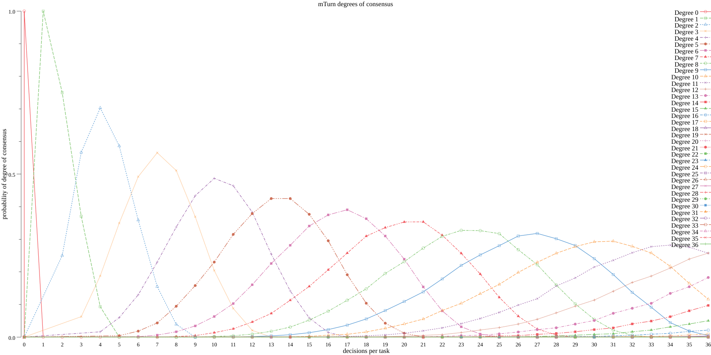

# Probability Playground
## Introduction
The main goal of this project is to explore applications of probability in real business situations that may be seen in daily life.

## Examples 
### Amazon Mechanical Turk and probability of random consensus on decision
Amazon Mechanical Turk provides the capability to distribute simple tasks to humans to solve. 
This capability is also known under the name of crowdsourcing. 

Because is hard to verify the quality of work product in such setup, the question arises: 
**What is the probability that in n-tasks workers deciding on random, will reach consensus on the same decision?**

This test case aims to calculate probability of random answers where:
- there is n-tasks to be solved by workers
- each worker can make one of four decision per task (independent, with identical probability)
- each tasks has to be answer k-times, by different workers

To measure the probability of agreement on decision let's introduce the concept called the degree of consensus:

> `n-degree consensus` = n-times the same decision was selected by k-number of independent workers. 

Example degrees and their interpretations
- consensus of degree 3 - happens when three independent workers make the same decision on one task
- consensus of degree 2 - happens when two independent workers choose the same decision, but one makes different
- consensus of degree 1 - happens when each worker makes different decision

Bellow you can see how probability of reaching different degrees of consensus (y axis) changes when more number of answers is collected per task (x axis)

Figure: Probability of reaching consensus of certain degrees, when number of independent decisions per tasks increases

To understand how this is implemented please take a look at example [example/aws_mechanical_turk_probability_of_consensus_monte_carlo_test.go](example/aws_mechanical_turk_probability_of_consensus_monte_carlo_test.go)
